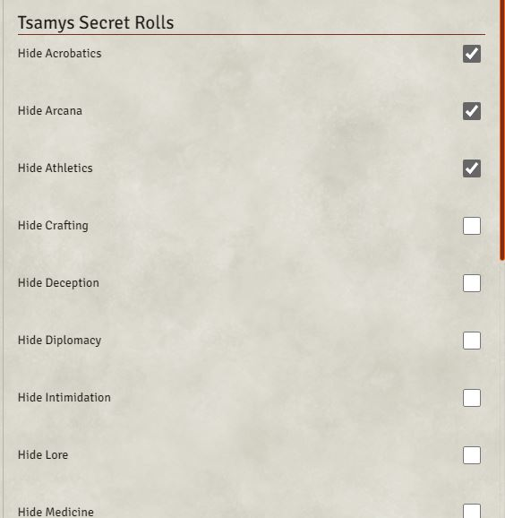
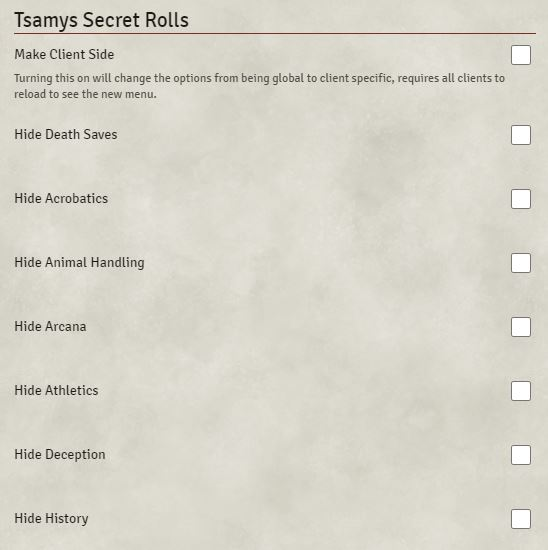

<h1>Tsamys Secret Rolls</h1>

A Simple module originally created for the Pathfinder 2nd Edition system but also works with D&D5e that allows the GM to set specific skill checks to always be blind GM rolls. 

This can be achieved by toggling the hide skill options in the game settings page.

Current Issues:
- (pf2e) The Lore Skill Check currently does not work due to their unique names however this will be resolved in the next version.

Future Plans:
- Add More options for when to apply the blind roll
- Add More types of rolls to apply blind roll to

